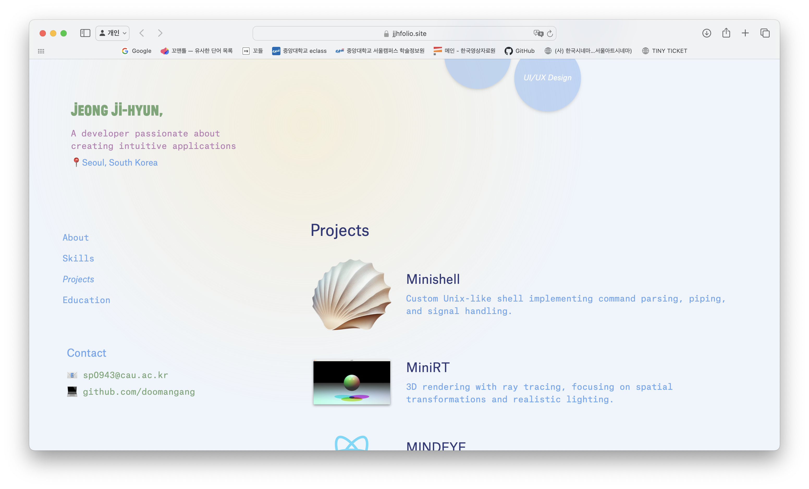

# **[Portfolio Website]**  
_A Modern and Interactive Portfolio Website built with Next.js and Tailwind CSS._

> _**Screenshot:**_
  

---

## **Features**

- 🖥️ **Responsive Design**: Fully optimized for desktop and mobile devices.
- 🌐 **Interactive Layout**:  
  - Desktop: Left column with `HeroSection` and `Contact`.  
  - Mobile: `HeroSection` appears at the top, `Contact` at the bottom.
- 🚀 **Dynamic Skills Section**:  
  - Fully interactive with hover animations.
- 🛠️ **Tech Stack**:  
  - **Framework**: Next.js (App Router with `app/` directory).  
  - **Styling**: Tailwind CSS with custom configurations.

---

This is a [Next.js](https://nextjs.org) project bootstrapped with [`create-next-app`]
